# 🚀 Dev Portfolio

[](https://nextjs.org/)
[](https://react.dev/)
[](https://www.typescriptlang.org/)
[](https://tailwindcss.com/)
[](LICENSE)
[]()

A modern, single-page developer portfolio built with Next.js 16, React 19, and Tailwind CSS 4. Features a glassmorphism design system with an animated aurora gradient mesh background, three switchable color palettes, and light/dark mode support.

## 📸 Preview

<p align="center">
  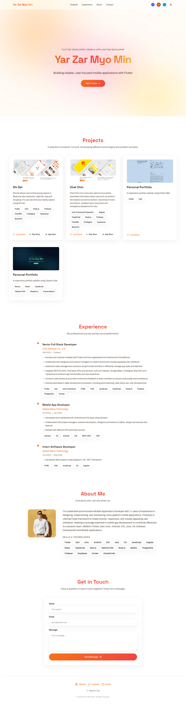
</p>

## ✨ Features

- 🪟 **Glassmorphism design** — translucent surfaces with `backdrop-filter: blur()`, semi-transparent borders, and soft shadows
- 🌌 **Animated aurora background** — floating gradient blobs with 12–15s animation cycles
- 🎨 **Three color palettes** — Aurora (indigo/pink/cyan), Sunset (orange/red/amber), Ocean (sky/emerald/cyan)
- 🌓 **Light & dark mode** — system preference detection with manual toggle, persisted to localStorage
- 🧩 **Five content sections** — Hero, Projects, Experience, About, Contact
- 📌 **Sticky glass header** — active section highlighting via IntersectionObserver
- 📱 **Responsive layout** — mobile-first grid that adapts from 1 to 3 columns
- 🖼️ **Image fallbacks** — `ImageWithFallback` component wraps `next/image` with SVG placeholder fallback
- ♿ **Accessible** — ARIA attributes, keyboard navigation, `prefers-reduced-motion` support

## 🛠️ Tech Stack

| Category | Technology |
|----------|-------------|
| Framework | [Next.js 16](https://nextjs.org/) (App Router) |
| UI Library | [React 19](https://react.dev/) |
| Language | [TypeScript 5](https://www.typescriptlang.org/) |
| Styling | [Tailwind CSS 4](https://tailwindcss.com/), CSS Custom Properties |
| Icons | [Lucide React](https://lucide.dev/) |
| Fonts | Archivo (body), Space Grotesk (headings) |
| Image Compression | [Sharp](https://sharp.pixelplumbing.com/) |

## 📸 Screenshots

<details open>
<summary><strong>🖥️ Desktop</strong> (1280×800)</summary>
<br>

| Hero | Projects |
|------|----------|
| 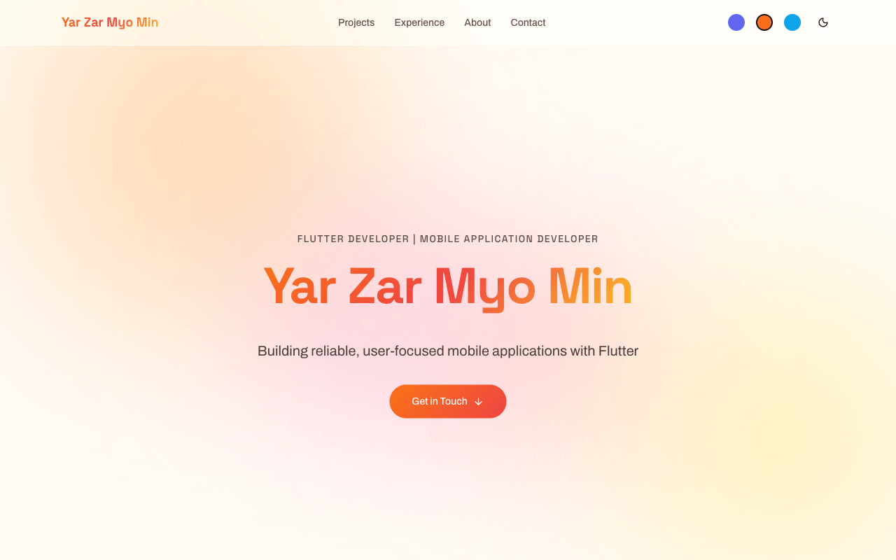 | 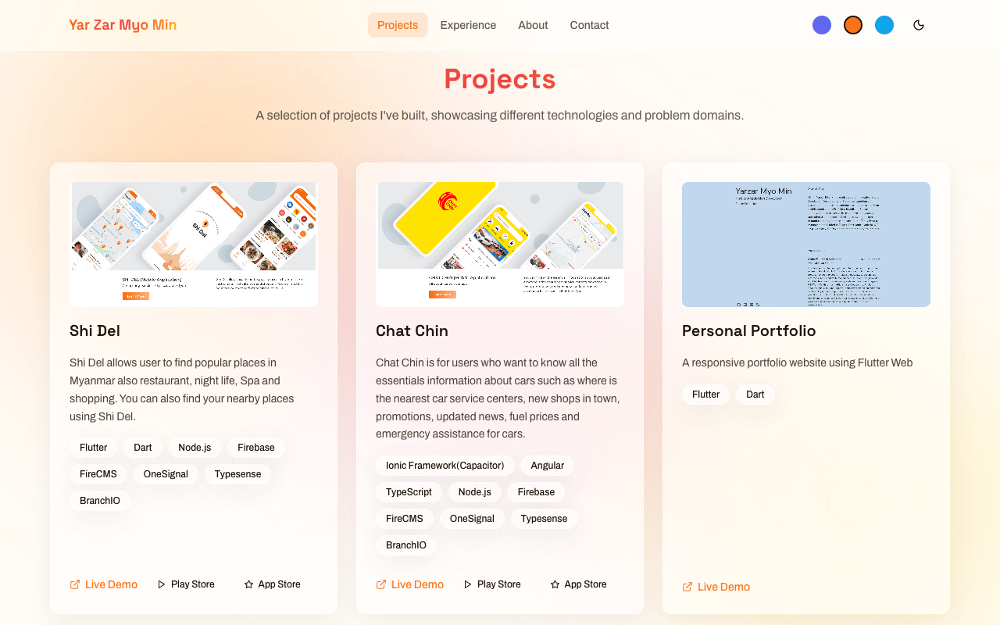 |

| Experience | About | Contact |
|------------|-------|---------|
| 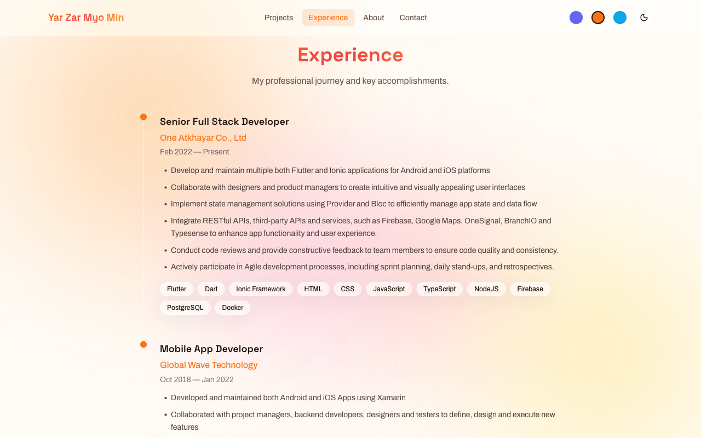 | 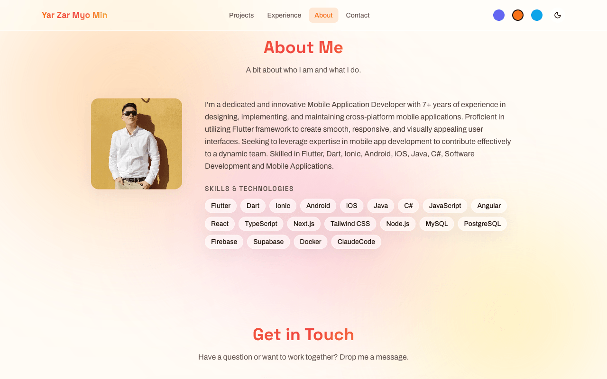 | 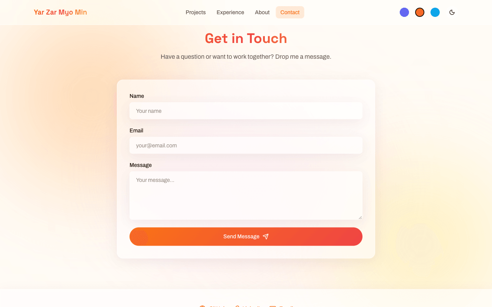 |

</details>

<details>
<summary><strong>📱 Mobile</strong> (390×844)</summary>
<br>

| Hero | Projects |
|------|----------|
| 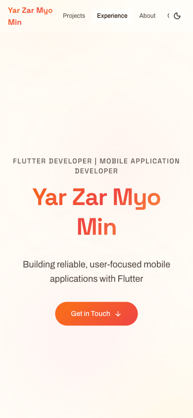 | 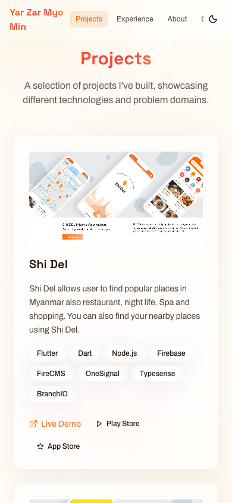 |

| Experience | About | Contact |
|------------|-------|---------|
| 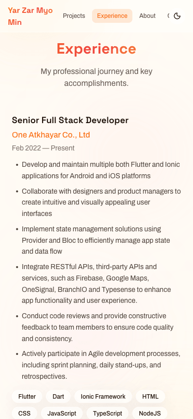 | 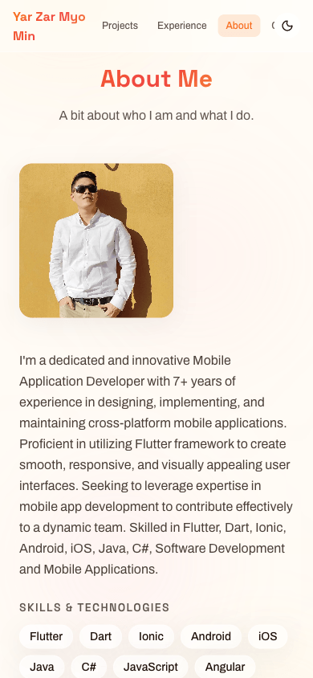 | 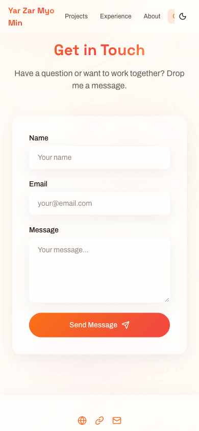 |

</details>

<details>
<summary><strong>🌐 Full Page</strong></summary>
<br>


</details>

## 🚀 Getting Started

```bash
npm install
npm run dev
```

Open [http://localhost:3000](http://localhost:3000).

## 📜 Scripts

| Command | Description |
|---------|-------------|
| `npm run dev` | Start development server |
| `npm run build` | Production build |
| `npm run start` | Serve production build |
| `npm run lint` | Run ESLint |

## 📁 Project Structure

```
app/
  _components/       # UI components (header, sections, theme controls)
  globals.css        # Global styles, glass utilities, aurora animations
  layout.tsx         # Root layout (fonts, ThemeProvider, aurora BG)
  page.tsx           # Main page assembling all sections
hooks/
  use-active-section.ts   # IntersectionObserver-based nav tracking
  use-theme.ts            # Theme state, palette switching, persistence
lib/
  data/              # Profile, projects, and experience data
  themes.ts          # Color palette definitions (light + dark variants)
  types.ts           # TypeScript interfaces
public/
  images/            # Project screenshots and profile photo
  placeholders/      # SVG fallback images
scripts/
  compress-screenshots.mjs   # PNG compression utility using Sharp
screenshots/         # Portfolio screenshots (desktop + mobile)
```

## 🚢 Deployment

This project is deployed on [Vercel](https://vercel.com/) with automatic deployments via GitHub Actions.

### Continuous Deployment

- **Production** — pushes to `main` trigger a production deploy
- **Preview** — pull requests generate preview URLs for review

### Deploy Your Own

[](https://vercel.com/new/clone?repository-url=https://github.com/yarzarmyomin97/dev_portfolio)

Or use the built-in Git integration:

1. Push to GitHub
2. Import project on [vercel.com](https://vercel.com)
3. Vercel auto-detects Next.js — click Deploy

### GitHub Actions Workflow

The deployment workflow is defined in [`.github/workflows/deploy.yml`](.github/workflows/deploy.yml) and requires these secrets:

| Secret | Description |
|--------|-------------|
| `VERCEL_TOKEN` | API token from [vercel.com/account/tokens](https://vercel.com/account/tokens) |
| `VERCEL_ORG_ID` | Team ID from `vercel link` |
| `VERCEL_PROJECT_ID` | Project ID from `vercel link` |

## 🔧 Customization

**Profile & content:** Edit the files in `lib/data/` — `profile.ts`, `projects.ts`, `experience.ts`.

**Themes:** Modify or add palettes in `lib/themes.ts`. Each palette defines 7 CSS custom properties (primary, secondary, accent, background, surface, text, border) for both light and dark modes.

**Images:** Place project screenshots in `public/images/` and update the `imagePlaceholder` paths in `lib/data/projects.ts`. Fallback SVGs live in `public/placeholders/`.

## ⭐ Star History

<a href="https://star-history.com/#yarzarmyomin97/dev_portfolio&Date">
  <picture>
    <source media="(prefers-color-scheme: dark)" srcset="https://api.star-history.com/svg?repos=yarzarmyomin97/dev_portfolio&type=Date&theme=dark" />
    <source media="(prefers-color-scheme: light)" srcset="https://api.star-history.com/svg?repos=yarzarmyomin97/dev_portfolio&type=Date" />
    
  </picture>
</a>

## 📄 License

This project is licensed under the [MIT License](LICENSE) — feel free to use, modify, and distribute.

---

<p align="center">
  Built with ❤️ using <a href="https://nextjs.org/">Next.js</a> · <a href="https://react.dev/">React</a> · <a href="https://tailwindcss.com/">Tailwind CSS</a>
</p>
